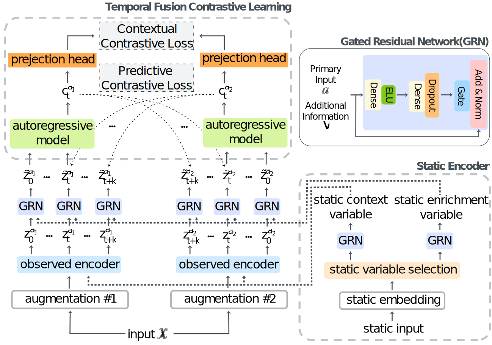

<!-- #region -->
<!-- [](https://github.com/imperial-qore/TranAD/blob/master/LICENSE) -->


# TFCL (Temporal Fusion Contrastive Learning) 


This repository is the official implementation of "**Human Activity Recognition via Temporal Fusion Contrastive Learning"** accepted in ``.


# Model Architecture



# Requirments

- `python` == 3.9
- `pytorch` == 1.10.1
- `pytorch-lightning` == 1.6.4


# How to start


## 1. Preprocess dataset

> ### A. Download dataset from following urls
>   - [MobiAct Dataset](https://bmi.hmu.gr/the-mobifall-and-mobiact-datasets-2/)
>   - [DRL Dataset](https://www.dlr.de/kn/en/desktopdefault.aspx/tabid-12705/22182_read-50785/)
   
<p>
    
> ### B. Run following ipynb files for each dataset
>   - MobiAct Datset - `datasets/preprocess_mobiact.ipynb`
>   - DLR Dataset - `datasets/preprocess_dlr.ipynb`
    
    
    
## 2. Hyper-parameters for `main.py`

> - `--experiment description` : set experiment description. Default : `Exp1`   
> - `--seed`: seed value. Default: `42`
> - `--model_type` : set model. Default : `TFCL`
> - `--training_mode`: choose training mode between `self_supervised`, `fine_tune`, `train_linear`, `supervised`. Default: `supervised`
> - `--loss_func`: choose between `focal` and `cross_entropy`. Default: `cross_entropy`
> - `--batch_size`: set batch_size. Default: `512`
> - `--aug_method1`: set first augmentation method. Default: `jitter_scale`
> - `--aug_method2`: set second augmentation method. Default: `permutation_jitter`
> - `--static_use`: choose whether to use static data. Use static data: `--static_use`, not use static data: `--no-static_use`
> - `--sampler_use`: choose whether to use imbalance dataset sampler. Use sampler: `--sampler_use`, not use sampler use: `--no-sampler_use`
> - `--dataset`: choose dataset. Default: `mobiact`
> - `--logs_save_dir`: saving directory. Default: `experiments_logs`
> - `--device`: choose device. Default: `cpu`
> - `--home_path`: home directory. Default: current directory
    
    
    
    

## 3. Training

### with static data + sampler

`Terminal command`

```
python main.py --model_type 'model_type' --sampler_use --dataset 'dataset_name' --device 'devce' --training_mode 'train_mode' --loss_func 'loss_function' --aug_method1 'first_augmentation_method' --aug_method2 'second_augmentation_method'
```

`Example`

```
python main.py --model_type TFCL --sampler_use --dataset mobiact --device 0,1 --training_mode self_supervised --loss_func focal --aug_method1 jitter_scale --aug_method2 permutation_jitter
```

### with static data + no sampler

`Terminal command`

```
python main.py --model_type 'model_type' --no-sampler_use --dataset 'dataset_name' --device 'devce' --training_mode 'train_mode' --loss_func 'loss_function' --aug_method1 'first_augmentation_method' --aug_method2 'second_augmentation_method'
```

`Example`

```
python main.py --model_type TFCL --no-sampler_use --dataset mobiact --device 0,1 --training_mode self_supervised --loss_func focal --aug_method1 jitter_scale --aug_method2 permutation_jitter
```

### without static data + sampler

`Terminal command`

```
python main.py --model_type 'model_type' --sampler_use --no-static_use --dataset 'dataset_name' --device 'devce' --training_mode 'train_mode' --loss_func 'loss_function' --aug_method1 'first_augmentation_method' --aug_metho2 'second_augmentation_method'
```

`Example`

```
python main.py --model_type TFCL --sampler_use --no-static_use --dataset mobiact --device 0,1 --training_mode self_supervised --loss_func focal --aug_metho1 jitter_scale --aug_method2 permutation_jitter
```

### without static data + no sampler

`Terminal command`

```
python main.py --model_type 'model_type' --no-sampler_use --no-static_use --dataset 'dataset_name' --device 'devce' --training_mode 'train_mode' --loss_func 'loss_function' --aug_method1 'first_augmentation_method' --aug_method2 'second_augmentation_method'
```

`Example`

```
python main.py --model_type TFCL --no-sampler_use --no-static_use --dataset mobiact --device 0,1 --training_mode self_supervised --loss_func focal --aug_method1 jitter_scale --aug_method2 permutation_jitter
```
<!-- #endregion -->
